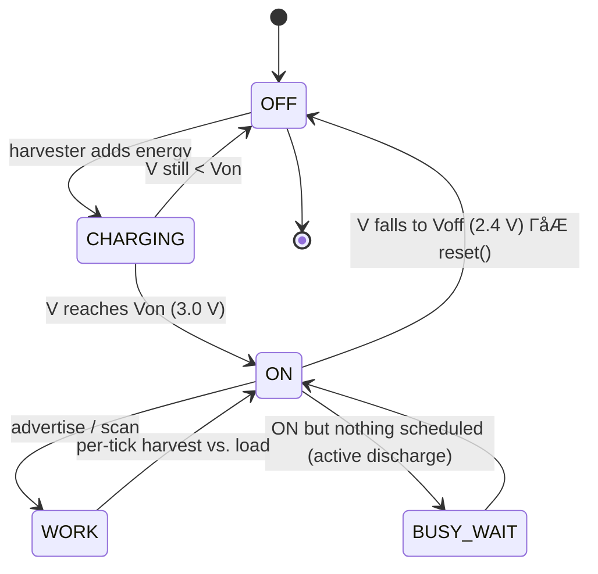

# Power Model for an Ambient-Energy-Powered MSP430FR5969 Node

**Scope.** This report justifies the supply-voltage thresholds, low-power-mode
selection, and power/energy figures used to model a battery-free IoT node built
around the **Texas Instruments MSP430FR5969** in the BFND simulator. It maps each
value to the device datasheet (TI SLAS704, *MSP430FR5969 Mixed-Signal
Microcontroller*) and to the simulator parameters in
[config_jogging.yaml](../config_jogging.yaml) and
[src/node/node.py](../src/node/node.py).

---

## 1. Target platform

The MSP430FR5969 is chosen because it is a canonical platform for *intermittent*,
battery-free computing:

| Feature | Value | Why it matters for an EH node |
|---|---|---|
| Memory | 64 KB **FRAM** | Non-volatile, byte-addressable, ~100 ns writes. State survives a power loss, so the node can checkpoint/recover across charge cycles. |
| Supply range | 1.8 V ΓÇô 3.6 V | Defines the *hard* lower/upper bounds for `Voff`/`Vmax`. |
| Active draw | ~100 ┬╡A/MHz @ 3 V | Sets the active-mode power used while advertising/scanning. |
| LPM3 (RTC) | ~0.4 ┬╡A @ 3 V | Sets the floor for the sleep-mode current with a clock running. |
| LPM4.5 | ~0.02 ┬╡A | Deep sleep, but loses peripheral/clock state ΓÇö *not* usable for a periodic tick. |
| RTC / timer | 32 kHz or VLO | Source for the 1 kHz wake-up tick used by the simulator clock. |

FRAM is the key enabler: because state is retained without power, the node can be
modelled as a machine that repeatedly **charges → boots → does work → browns out
→ resets**, rather than losing everything on each power cycle.

---

## 2. Supply-voltage thresholds (`Von`, `Voff`, `Vmax`)

The node is powered from a storage capacitor, **not** a regulated rail. Three
thresholds define its behaviour. In the simulator (jogging profile):

```yaml
von:       3.0   # turn-on threshold (V)
voff:      2.4   # brown-out / turn-off threshold (V)
v_max_thr: 3.3   # upper clamp (V)
capacitance: 47.0e-6   # 47 ┬╡F storage capacitor
```

### 2.1 `Voff = 2.4 V` ΓÇö turn-off / brown-out
- The MSP430FR5969 is fully operational down to **1.8 V**, but FRAM writes and the
  radio front-end are the limiting consumers. A 2.4 V floor leaves comfortable
  margin above the absolute minimum so that an in-flight FRAM write or radio
  transaction completes correctly even as the capacitor sags under load.
- It also keeps the node above the brown-out-reset (BOR) region with margin,
  avoiding partial/corrupt resets.
- In the model, dropping below `Voff` forces `STATE.OFF` and a `reset()`
  (see `compute_energy_level` in [src/node/node.py](../src/node/node.py#L54)).

### 2.2 `Von = 3.0 V` ΓÇö turn-on
- The node must not start work the instant it crosses `Voff`; doing so would let
  it immediately brown out under the first active-mode load. A **hysteresis band**
  between `Voff` (2.4 V) and `Von` (3.0 V) guarantees a minimum stored-energy
  budget is available before any work begins.
- The usable energy in that band (Section 5) is sized so that at least one full
  advertisement plus housekeeping fits inside it ΓÇö i.e. the node is guaranteed to
  accomplish useful work each time it wakes.

### 2.3 `Vmax = 3.3 V` ΓÇö upper clamp
- Sits safely below the 3.6 V absolute maximum supply, modelling a practical
  harvester/clamp (e.g. a shunt or a regulator's input limit). Energy harvested
  above this point is discarded, which the simulator handles via
  `on_voltage_above_vmax_thr`.

**Voltage Γçä energy relation.** The model stores *energy* and converts to voltage
with the capacitor energy law:

$$E = \tfrac{1}{2} C V^2 \quad\Longleftrightarrow\quad V = \sqrt{\dfrac{2E}{C}}$$

This is exactly the expression used in `compute_energy_level`.

### 2.4 Why not deep-discharge (`Voff` 1.8 V / `Von` 2.4 V / `Vmax` 3.6 V)?

A tempting alternative is to use the full datasheet supply range ΓÇö `Voff = 1.8 V`,
`Von = 2.4 V`, `Vmax = 3.6 V` ΓÇö to bank and extract more energy. The trade-off is
decided by two tests.

**Test 1 ΓÇö does one advertisement brown the node out?** `eadv` = 48.05 ┬╡J is
removed in a single slot, so the post-advertisement voltage is the critical figure:

| Scheme | Energy at `Von` | After 1 advert (−48.05 µJ) | Post-advert voltage |
|---|---|---|---|
| **Current** (3.0 / 2.4) | 211.5 ┬╡J | 163.45 ┬╡J | **2.64 V** |
| Deep-discharge (2.4 / 1.8) | 135.4 ┬╡J | 87.3 ┬╡J | **1.93 V** |

In the deep-discharge scheme a single advertisement lands at **1.93 V ΓÇö only
130 mV above the 1.8 V hard floor.** Adding ESR droop and the radio's high-current
burst (≈10 mA over 47 µF ⇒ ~0.2 V/ms slew plus ESR drop), the *instantaneous*
rail will likely dip below 1.8 V and brown out **mid-transmission**. The current
scheme settles at 2.64 V with comfortable margin.

**Test 2 ΓÇö working budget per turn-on.** Both schemes share a 0.6 V hysteresis,
but energy scales with $V^2$, so the same swing yields less usable energy at lower
voltage:

$$E_\text{usable} = \tfrac12 C\,(V_\text{on}^2 - V_\text{off}^2)$$

| Scheme | $V_\text{on}^2-V_\text{off}^2$ | Usable per turn-on | Margin over 1 advert |
|---|---|---|---|
| **Current** (3.0 / 2.4) | 3.24 | **76.1 µJ** | 28 µJ (1.6×) |
| Deep-discharge (2.4 / 1.8) | 2.52 | **59.2 µJ** | 11 µJ (1.2×) |

The current scheme gives **~2.5× more working margin** per wake.

**What deep-discharge *does* buy.** Its only genuine advantage is the higher
`Vmax`: total bankable energy from `Vmax` down to `Voff` is 120.6 ┬╡J (current) vs
228.4 ┬╡J (deep-discharge, ~90% more), so it utilises harvested energy more
aggressively and yields longer on-times once fully charged ΓÇö at the cost of
reliability and a lower max MCLK near 1.8 V.

**Recommendation.** Keep **2.4 / 3.0 / 3.3** as the baseline: it guarantees an
advertisement completes without browning out, keeps the radio in its reliable band,
and leaves margin for the rest of the slot's work. Deep-discharge (1.8 / 2.4 / 3.6)
is only justified if (a) the **radio's** minimum operating voltage is verified
Γëñ 1.8 V, (b) explicit ESR/droop margin is added or `C` is increased (e.g. 100 ┬╡F)
so one advert does not approach the floor, and (c) the research question is
specifically about maximising deep-discharge energy utilisation. A safe middle
ground is **`Voff` 2.0 / `Von` 2.8 / `Vmax` 3.6** → post-advert ≈ 2.27 V, usable
65.8 ┬╡J, while still banking ~234 ┬╡J at the top.

---

## 3. Power-mode selection

Two operating modes are modelled, matching how real intermittent firmware runs:

### 3.1 Active Mode (AM) ΓÇö during advertise / scan / busy-wait
- **Current:** 103 ┬╡A (Γëê the datasheet ~100 ┬╡A/MHz figure at Γëê1 MHz MCLK, 3 V).
- **Power:** $P_\text{active} = 103\ \mu\text{A} \times 3\ \text{V} = 309\ \mu\text{W}$.
- Used whenever the CPU/radio is doing work: transmitting an advertisement,
  scanning, or *actively discharging* via `ACTION.BUSY_WAIT`.

### 3.2 Sleep ΓÇö **LPM3 with the RTC running**, *not* LPM3.5/LPM4.5
This is the central power-mode decision, driven by the **1 kHz tick** requirement.

The simulator's clock fires at `clock_frequency: 1000`, i.e. the node must wake
**every 1 ms** to advance its slot counter (`ASN`) and run the protocol state
machine. That requirement rules out the deepest modes:

| Mode | RTC running? | RAM/register retention? | Wake latency | Verdict |
|---|---|---|---|---|
| LPM4 / LPM4.5 | No (LPM4) | No (LPM4.5 loses it) | Reboot (LPM4.5) | Γ£ù Cannot keep a 1 kHz tick; would lose slot state every wake. |
| LPM3.5 | RTC only | No (cold boot on wake) | Reboot | Γ£ù Re-initialising every 1 ms is nonsensical. |
| **LPM3** | **Yes (ACLK/RTC)** | **Yes** | **~┬╡s** | Γ£ô CPU off, clock alive, full state retained ΓÇö exactly what a periodic-tick node needs. |

**Conclusion:** with a 1 kHz periodic wake-up that must preserve protocol state,
**LPM3** is the correct sleep mode. LPM3.5/LPM4.5 are only appropriate for nodes
that sleep for long, event-driven intervals and tolerate a cold boot ΓÇö the
opposite of this design.

---

## 4. Sleep-energy figure (`esleep = 10.5 nJ` per 1 ms tick)

```python
self.esleep = 10.5e-9     # J per tick   (src/node/node.py)
```

A pure LPM3 floor (≈0.4 µA → 1.2 µW → 1.2 nJ/ms) is *lower* than this. The extra
energy is the **cost of the 1 kHz wake-up itself**: every millisecond the CPU
briefly leaves LPM3, services the RTC/timer ISR, advances the clock, and returns
to sleep. Modelling that as a short active burst on top of the LPM3 floor:

$$E_\text{sleep} = P_\text{active}\,t_\text{wake} + P_\text{LPM3}\,(T - t_\text{wake})$$

Solving for the active fraction with $P_\text{active}=309\ \mu\text{W}$,
$P_\text{LPM3}=1.2\ \mu\text{W}$, $T = 1\ \text{ms}$, $E_\text{sleep}=10.5\ \text{nJ}$:

$$t_\text{wake} \approx \frac{10.5\ \text{nJ} - 1.2\ \text{nJ}}{309\ \mu\text{W} - 1.2\ \mu\text{W}} \approx 30\ \mu\text{s}$$

So **10.5 nJ/tick** corresponds to ~30 ┬╡s of active ISR servicing per millisecond
plus LPM3 the rest of the time ΓÇö i.e. an **average sleep current of Γëê3.5 ┬╡A at
3 V**. This is a realistic, slightly conservative figure for a node kept awake by
a 1 kHz interrupt, and it deliberately captures the wake-up overhead that a naive
"datasheet LPM3 only" number would miss.

### `ebusy_wait = 309 nJ` per tick ΓÇö active discharge
```python
self.ebusy_wait = 309e-9   # J per tick
```
When a node is `ON` but has no work scheduled, it stays in **active mode** to drain
the capacitor on purpose (`ACTION.BUSY_WAIT`), replicating the Find firmware's
behaviour described in [README.md](../README.md). The cost is simply full active
power for the whole 1 ms slot: $309\ \mu\text{W} \times 1\ \text{ms} = 309\ \text{nJ}$.

---

## 5. Per-operation energy costs and the energy budget

```yaml
eadv:  48.05e-6   # advertisement (J)
escan:  3.0e-6    # scan (J)
```

**Usable energy in the hysteresis band** (the budget the node has each time it
turns on at `Von` until it browns out at `Voff`):

$$E_\text{usable} = \tfrac{1}{2}C\left(V_\text{on}^2 - V_\text{off}^2\right)
= \tfrac{1}{2}(47\,\mu\text{F})(3.0^2 - 2.4^2) \approx 76.1\ \mu\text{J}$$

Sanity checks against the operation costs:

| Quantity | Value | Note |
|---|---|---|
| Energy at `Von` (3.0 V) | $\tfrac12 C V_\text{on}^2 = 211.5\ \mu\text{J}$ | Full "tank" at turn-on. |
| Energy at `Voff` (2.4 V) | $135.4\ \mu\text{J}$ | Reset point. |
| Usable per cycle | $76.1\ \mu\text{J}$ | Sized for ≥1 advertisement. |
| One advertisement (`eadv`) | $48.05\ \mu\text{J}$ | Drops the rail **3.0 V → 2.64 V** in one slot. |
| One scan (`escan`) | $3.0\ \mu\text{J}$ | Cheap; many fit per cycle. |
| Headroom `Von→Vmax` | $44.4\ \mu\text{J}$ | Buffer before the clamp discards energy. |

The budget is deliberately tuned so that **one charge cycle guarantees at least
one full advertisement** (48 ┬╡J < 76 ┬╡J usable) ΓÇö the minimum useful unit of work
for neighbour discovery ΓÇö with margin left for sleep ticks and scanning.

---

## 6. Charge / discharge behaviour of the node

Putting the thresholds, modes, and energy costs together gives the
intermittent-operation cycle the simulator reproduces tick-by-tick:



1. **Dead / charging (OFF, below `Von`).** The harvester (here, the jogging trace
   in [config_jogging.yaml](../config_jogging.yaml)) deposits small packets of
   energy each 1 ms tick: $\Delta E = P_\text{harvest}\cdot T$. Voltage climbs as
   $V=\sqrt{2E/C}$. The node does nothing ΓÇö it isn't even guaranteed to be running.
2. **Turn-on at `Von` = 3.0 V.** Crossing `Von` flips the node to `STATE.ON`
   (`on_turn_on`). It now has Γëê76 ┬╡J of usable budget.
3. **Active work.** Each advertisement removes 48.05 ┬╡J in a single slot (a sharp
   ~0.36 V drop); scans remove 3 ┬╡J; sleep ticks remove 10.5 nJ; busy-wait removes
   309 nJ. Net voltage change per tick = harvested − consumed.
4. **Charge clamp at `Vmax` = 3.3 V.** If harvesting outpaces consumption, voltage
   is capped at 3.3 V and surplus energy is discarded (`on_voltage_above_vmax_thr`).
5. **Brown-out at `Voff` = 2.4 V.** When the load (especially repeated
   advertisements or active busy-wait) drains the capacitor to `Voff`, the node
   crosses to `STATE.OFF` and `reset()` runs. Because state lives in FRAM, the
   node can recover/continue on the next charge cycle rather than starting from
   absolute zero.
6. **Repeat.** The harvester recharges the capacitor and the cycle restarts.

The *period* of this cycle is set by the ratio of harvested power to the
per-cycle energy budget ΓÇö which is precisely what the BFND vs. Find comparison
in the simulator measures.

---

## 7. Summary of justified values

| Parameter | Value | Source / justification |
|---|---|---|
| Supply range | 1.8ΓÇô3.6 V | MSP430FR5969 datasheet (SLAS704). |
| `Voff` | 2.4 V | Margin above BOR / min-write voltage for safe FRAM + radio operation. |
| `Von` | 3.0 V | Hysteresis above `Voff` guaranteeing ≥1 advertisement of budget. |
| `Vmax` | 3.3 V | Practical clamp below the 3.6 V absolute max. |
| `C` | 47 ┬╡F | Sizes the per-cycle budget to ~76 ┬╡J usable. |
| Active current | 103 ┬╡A @ 3 V | ~100 ┬╡A/MHz datasheet figure at Γëê1 MHz. |
| Active power | 309 ┬╡W | $103\,\mu\text{A}\times3\,\text{V}$. |
| Sleep mode | **LPM3 + RTC** | Only mode that keeps a 1 kHz tick *and* retains state. |
| `esleep` | 10.5 nJ/tick | LPM3 floor + ~30 ┬╡s/ms active ISR for the 1 kHz wake (Γëê3.5 ┬╡A avg). |
| `ebusy_wait` | 309 nJ/tick | Full active power for a whole 1 ms slot (active discharge). |
| `eadv` | 48.05 ┬╡J | One advertisement; fits within the 76 ┬╡J usable budget. |
| `escan` | 3.0 ┬╡J | One scan; low cost, many per cycle. |
| Tick rate | 1 kHz | RTC/timer wake-up; 1 ms simulator slot (`clock_frequency: 1000`). |
```
